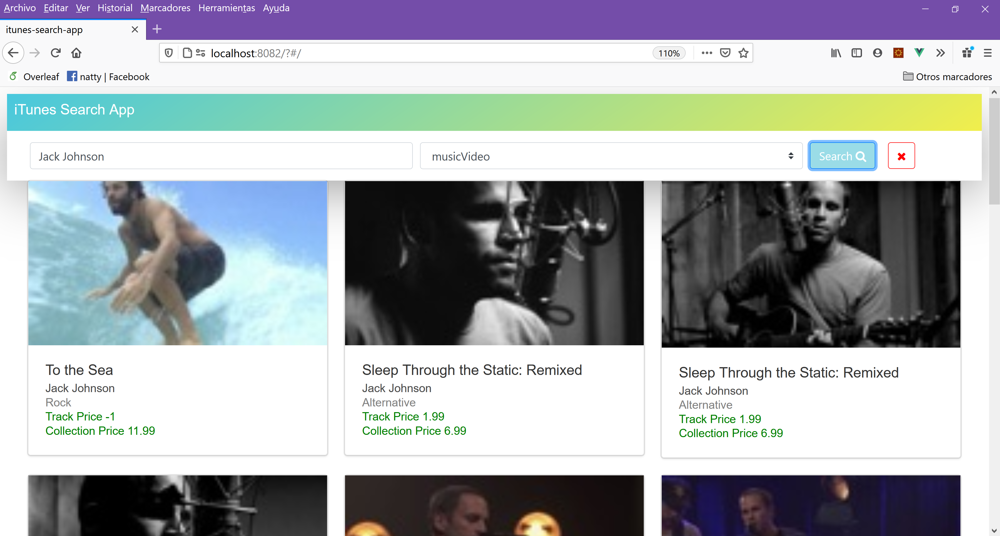

# Itunes Search App
###Andrea Natalia Villarroel Camacho

La Aplicación, fue desarrollada con Vuejs, con el fin de recrear un nuevo buscador de artistas utilizando la API de iTunes.

La aplicación muestra un listado de tarjetas con la imágen y el nombre del ítem seleccionado, el nombre del artista, y su respectivo precio.

La aplicación en sí, puede llegar a listar un audio libro, álbum de música, nombres de videos musicales, podcast y programas de televisión de un artista y redirigirlo a la aplicación de iTunes para que pueda descargar o comprar el contenido que desee, según sea el caso.

Informe de proyecto:

https://docs.google.com/document/d/1le4x-SJY7dHXJSEksfGfV1FN5XODBTjb93egxtzIkaU/edit?usp=sharing